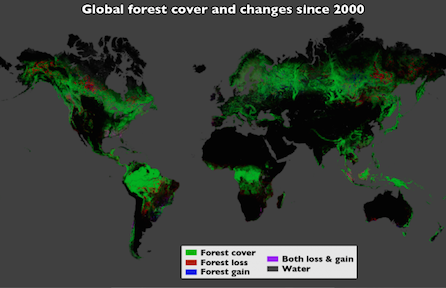
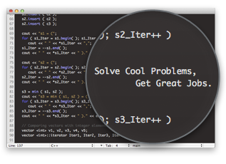
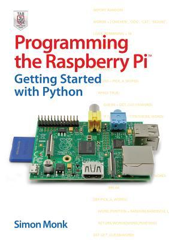
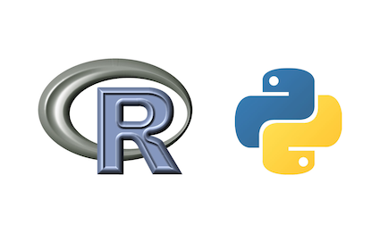
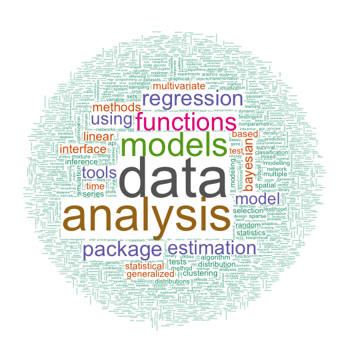
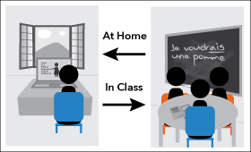
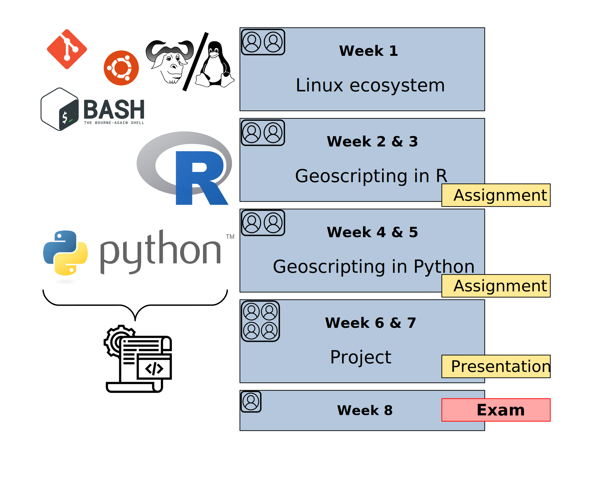
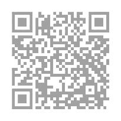
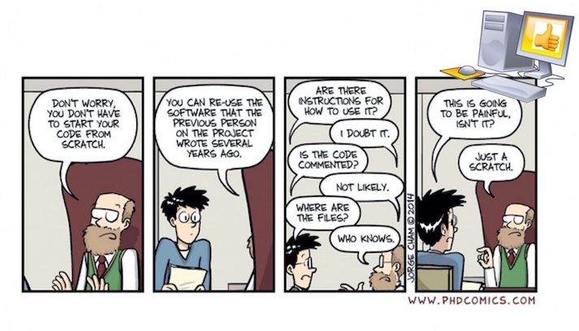

## What comes to mind when you think of Geoscripting?

Answer on Wooclap in the link in the chat!

## Did you know?!

Scripting can be used to process satellite data easily to monitor deforestation globally

- Google Earth Engine for global deforestation monitoring
      - https://earthengine.google.org/#intro

{width=50%}

Image Credit: NASA Goddard, based on data from Hansen et al., 2013.

## Why geoscripting?



## Why geoscripting?

- Reproducible: you keep track of what you have done 
- Efficient: you can write a script to do something and repeat your analysis x1000... 
  - Good for finding errors

Can you think of other advantages?

## Why geoscripting?

-  Enable collaboration
    - a huge social R and Python community
    


## Why geoscripting?

- Build your own tools and functions (e.g. automated web-processing, etc.)

{width=30%}

[See demos on the course website!](https://geoscripting-wur.github.io/Scripting4Geo/#why-scripting)

## What is a scripting (interpreted) language?

## What  is a scripting language?

- A scripting language can interpret and automate the execution of tasks, instead of clicking!!!
- A scripting language is the glue, between different commands, functions, and objectives without the need to compile it for each OS (e.g. windows)
- This is different from a compiled language like C/C++/Fortran 
    - these are languages that need to compile the whole program/app first.

## Compiling

Passing the source code through a compiler, which translates the `high-level language` instructions into an `exe`.

```{r, echo=FALSE, fig.align='center', fig.width=6, strip.white=TRUE}
library(png)
library(grid)
img <- readPNG("figs/traditionalCompiler.png")
grid.raster(img)
```

## The main scripting languages for GIS and Remote sensing currently are: 

- R
- Python
- Julia
- GRASS (functions are also included in QGIS)
- JavaScript (geoweb scripting)
- Matlab
- IDL (ENVI)
- ...

## Python versus R

- Python is a general purpose programming language, stronger in deep learning
- R is easier to use and is particularly strong in statistical computing and visualisation
- Syntactic differences between R and Python can be confusing
- There are many R and Python packages for spatial analyses



## R packages


## Many programs have support for Python & R

e.g.:
 
 - QGIS
 - GRASS
 - PostGIS

<!--
## ...Cliffhanger!

How will you learn about all that in the course? Find out after this 5-minute break!

{width=70%}

-->

## The Geoscripting course

Goal:

- Scripting to solve spatial challenges!
- **Learn by doing**
- **Learn how to keep on learning**


A team of `R` & `Python` experts who use geo-scripting languages 
every day helped to develop this course

## Who are we?

- Course coordinator: Dainius Masiliūnas
- Lecturer: Arno Timmer
- Teaching assistants (PhD): Tijmen Remijnse, Xuemeng Tian, Yang Li
- Teaching assistants (MSc): Wybren de Jong, Janiek Hooijman, Ella van Loenen 
- Guest lecturers: See course guide

## Geoscripting learning objectives

- Demonstrate scripting skills by writing clear, documented, and reproducible scripts to read, write and visualise spatial data 
- Apply version control supporting effective collaboration in a team 
- Use documentation, (search) tools, and contribute to discussion platforms with reproducible examples as an aid to solve scripting challenges effectively 
- Be willing to use and create open-source software with an appropriate software license 
- Combine functions from novel libraries to efficiently process spatial data 
- Create an integrated software project that solves a spatial challenge 

## Course concept

Flipped Classroom concept:



* Experts from companies, research institutes and 
university will present (guest presentations)

## How will we learn all that?

{width=70%}
<!-- Uncomment below for PDF, above for HTML
-->

## Deliverables

* Practice exercises: in pairs, not graded, but peer reviewed; assignments and exam are very similar, so good practice!
* Graded assignments: in pairs, graded (**20%**) and peer reviewed; peer review is graded too!
* Exam: individual assignment, graded (**30%**), **not** peer reviewed but receive feedback from autotests, mostly practice.
* Final project: in groups of four, graded (**50%**) and peer reviewed.
  * Choose a geoscripting topic feasible within 7 half-days

## Exercises

* Starter material will be made available for each group/person on GitLab: [https://git.wur.nl/geoscripting-2025](https://git.wur.nl/geoscripting-2025).
* Every change in your starter is automatically submitted to Brightspace (CodeGrade), rubrics and automatic feedback is available there.

## AI Traffic Light {.columns-2}

{width=100%}

<p class="forceBreak"></p>

Green – Extensive Use

* Students can use generative AI throughout their work, as long as they disclose usage and critically reflect on its contribution.
* WUR resources on Generative AI: 

## Peer review

- When you do peer review, check the exercise of the day on Brightspace.
- You get access to the solution of the teams you are supposed to review.
- Review according to the rubric on Brightspace (CodeGrade) and the exercise/assignment description.
  - You can use in-line comments and general comments.
  - Don't review the review.
  - In upcoming exercises, reproducibility is a prerequisite!

## Team work & helping each other

- Log into GitLab: [https://git.wur.nl/-/profile/account](https://git.wur.nl/-/profile/account)
- Set up teams of two:
  - Check your group on Brightspace (https://brightspace.wur.nl) > Deliverables > Practice exercises > Exercise 1!
  - If you don't have a team member, join an existing group with one person, if none, create a new group and join it
  - For project work, you will work in groups of 4, which we will set based on your chosen topics

<div class="centered">

</div>

## Heeelp!

Confused?! Always start in Microsoft Teams!

- Find your teammate! You can use Microsoft Teams (https://teams.microsoft.com) to write them a message
- Announcements in the Announcements channel!
- If you like, you can create a new channel for your team's internal communication
- Tabs at the top link to all content!
- Support in the Support channel! Or raising your hand in class.
- Offline support on the Brightspace discussion forum!

## What we will do next

* Today:
  * 14:00 - 14:45: this presentation
  * 15:00 - 15:30: Software licenses (Andrei Mirt)
  * 15:45 - 17:15: Self-study ([geoscripting-wur.github.io](https://geoscripting-wur.github.io))
* Tomorrow:
  * 14:00 - **17:00**: Use git to submit your thoughts on what you would like to work on during the course
  * 16:00 - 16:30: Demo on how to use CodeGrade
* Wednesday:
  * 15:50 - 16:35: Discussion about the first exercise
  * 16:50 - 17:20: Presentation about Git
  * Rest of the day: self-study Bash tutorial, finish peer review  of the previous exercise by the end of the day

Deadlines are always **hard**!

## What we will do every two days

* Monday & Wednesday (Wednesdays shifted 1.5 hours later):
  * 14:00 – 14:45: 	Guest presentation and/or plenary discussion session about tutorial and exercise 
  * 14:45 – 15:30:	Review of exercise from day before: feedback from the teachers, best solutions, and common mistakes; introduction to the tutorial of today 
  * 15:30 – 17:10: 	Follow tutorial and answer questions (individually, self-study); finish peer review of exercise or assignment from the previous day 
* Tuesday & Thursday:
  * 14:00 – 17:00: 	Work on exercise (in pairs, teaching assistants available), submission via CodeGrade in Brightspace
* Friday 14:00: assignments/project preparation work

## Summary

* Geoscripting is an essential skill in research, as well as highly sought-after in the industry
* Scripting saves you time in the long run
* Geoscripting is an intensive, whole-day course where you learn best by doing
* Deliverables are all practice, little theory!
* Mind the deadlines, and don't forget to review others!

## Learning outcomes of the rest of today and tomorrow:

- Getting started with Linux, Git
- Submit an exercise to CodeGrade!
- Think of the project topic

## Questions?

<!--- What is a "reproducible script"?

## Reproducibility

-->

<!--
```{r, fig.align='center', echo=FALSE, message=FALSE, eval=FALSE}
if (!file.exists(fn <- "figs/worldcloudRpackage.png")) {
    fn <- "figs/worldcloudRpackage.png"
    require(XML)
    require(tm)
    require(wordcloud)
    require(RColorBrewer)
    u = "http://cran.r-project.org/web/packages/available_packages_by_date.html"
    t = readHTMLTable(u)[[1]]
    ap.corpus <- Corpus(DataframeSource(data.frame(as.character(t[,3]))))
    ap.corpus <- tm_map(ap.corpus, removePunctuation)
    # ap.corpus <- tm_map(ap.corpus, tolower)
    #  txt.corpus <- tm_map(txt.corpus, tolower)
    # must be changed to
    ap.corpus <- tm_map(ap.corpus, content_transformer(tolower))
    ap.corpus <- tm_map(ap.corpus, function(x) removeWords(x, stopwords("english")))
    ap.tdm <- TermDocumentMatrix(ap.corpus)
    ap.m <- as.matrix(ap.tdm)
    ap.v <- sort(rowSums(ap.m),decreasing=TRUE)
    ap.d <- data.frame(word = names(ap.v),freq=ap.v)
    table(ap.d$freq)
    pal2 <- brewer.pal(8,"Dark2")
    png(fn, width=1280, height=800)
    wordcloud(ap.d$word,ap.d$freq, scale=c(8,.2),min.freq=3,
    max.words=Inf, random.order=FALSE, rot.per=.15, colors=pal2)
    dev.off()    
}
```
-->
