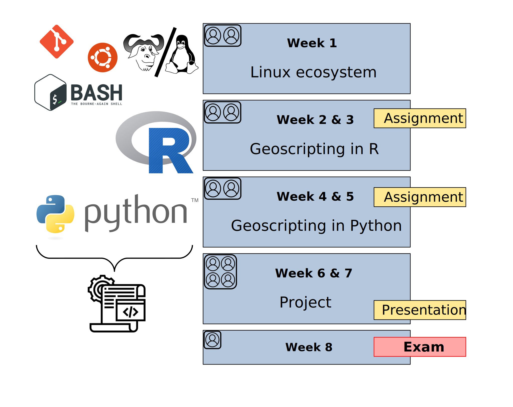

## Did you know?!

Scripting can be used to process satellite data easily to monitor deforestation globally

- Google Earth Engine for global deforestation monitoring
      - https://earthengine.google.org/#intro

{width=50%}

Image Credit: NASA Goddard, based on data from Hansen et al., 2013.

## Why geoscripting?


## Why geoscripting?

- Reproducible: you keep track of what you have done 
- Efficient: you can write a script to do something and repeat your analysis x1000... 
  - Good for finding errors

Can you think of other advantages?

## Why geoscripting?

-  Enable collaboration
    - a huge social R and Python community
    


## Why geoscripting?

- Build your own tools and functions (e.g. automated web-processing, etc.)

{width=30%}

[See demos!](https://geoscripting-wur.github.io/Scripting4Geo/#why-scripting)

## The Geoscripting course

Goal:

- Scripting to solve spatial challenges!
- **Learn by doing**
- **Learn how to keep on learning**


A team of `R` & `Python` experts who use geo-scripting languages 
every day helped to develop this course

## Geoscripting learning objectives

...are changing! In your case, by the end of the course, you should be able to:

- Demonstrate scripting skills by writing clear, documented and reproducible scripts to read, write and visualise spatial data 
- Use documentation, search tools and contribute to discussion platforms with reproducible examples as an aid to solve scripting challenges effectively
- Combine functions from novel libraries to efficiently process spatial data 
- Create an integrated software project that solves a spatial challenge 

## Course concept

Flipped Classroom concept:


* Experts from companies, research institutes and 
university will present (guest lectures)

## How will we learn all that?

{width=70%}
<!---->

## What we will do every day

* 08:30 - 11:00: Self-study (individually)
* 11:00 - 12:00: Work on exercise of the day (in pairs)
* 12:00 - 13:00: Lunch break
* 13:00 - 15:00: Work on exercise of the day (in pairs)
* 15:00 - 15:30: Review exercise of two other teams
* 15:30 - 16:30: Discussion session
* 16:30 - 17:00: Guest lecture

Exceptions: Assignment days (Thursdays), the exam day and the project week: whole day work!

## Deliverables

* Exercises: in pairs, not graded, but peer reviewed; assignment and exam are very similar, so good practice!
* Assignments: in pairs, graded (**20%**) and peer reviewed; peer review is graded too!
* Exam: individual, graded (**30%**), **not** peer reviewed but receive feedback from autotests, all practice.
* Final project: in pairs, graded (**50%**) and peer reviewed.
  * Think of a geoscripting topic feasible within 3.5 days with 2 people

Starter material will be made available for each group/person on GitHub: [https://github.com/geoscripting-2021](https://github.com/geoscripting-2021).
Every change in the starter is automatically submitted to Brightspace (CodeGrade), rubrics and automatic feedback is available there.

## Team work & helping each other

- Fill out your GitHub username by filling in [a form](https://forms.office.com/Pages/ResponsePage.aspx?id=5TfRJx92wU2viNJkMKuxj88C6SyKcgxPn86ClQcDHjRUOEpBVlgwVElFV1U3TDdER0k2MzFCSklOQSQlQCN0PWcu)
- Teams of two:
  - Create or join a group on Brightspace > Exercises > Exercise 1
  - For project work there is a possibility to change your groups

<div class="centered">

</div>

## Heeelp!

Confused?! Always start in Microsoft Teams!

- Announcements in the General channel!
- Each pair gets a channel! So you (and we) can talk to each other directly!
- Tabs at the top link to all content!
- Support in the Support channel! Simply join one (or more) of the ongoing meetings and raise your hand!
- Offline support on the Scoold Q&A platform!

## What we will do today

* 08:30 - 9:15:  Introduction presentation
* 09:30 - 10:00: Introduction to version control
* 10:00 - 12:00: Self-study
* 12:00 - 13:00: Lunch break
* 13:00 - **15:00**: Think about a topic for your project and submit your thoughts
* 15:00 - **15:30**: Review the idea of two other teams
* 15:30 - 16:00: Discussion session

Deadlines are always **hard**!

## Peer review

- When you do peer review, use the peer review team selector!
- You get a link to the repository of the teams you are supposed to review.
- Go to "Issues" and open an issue; enter your team name in the title.
- Review according to the rubric on Brightspace (CodeGrade) and the exercise/assignment description.

## Learning outcomes of today:

- Getting started with Linux, Git
- Submit an exercise to CodeGrade!
- Think of the project topic
    
## What  is a scripting language?

- A scripting language can interpret and automate the execution of tasks, instead of clicking!!!
- A scripting language is the glue, between different commands, functions, and objectives without the need to compile it for each OS (e.g. windows)
- This is different from like C/C++/Fortran 
    - these are languages that need to be compiled first.

## Compiling

Passing the source code through a compiler, which translates the `high-level language` instructions into an `exe`.

```{r, echo=FALSE, fig.align='center', fig.width=6, strip.white=TRUE}
library(png)
library(grid)
img <- readPNG("figs/traditionalCompiler.png")
grid.raster(img)
```

## The main scripting languages for GIS and Remote sensing currently are: 

- R
- Python
- GRASS (grass function are included in QGIS)
- JavaScript for geoweb scripting
- Matlab
- IDL (ENVI)
- ...

## Python versus R

- Python is a general purpose programming language
- R is particularly strong in statistical computing and graphics
- Syntactic differences between R and Python can be confusing  
- There are many R and Python packages for spatial analyses


## R packages


## Many programs have support for

 Python & R e.g.:
 
 - QGIS
 - GRASS
 - PostGIS

## Time for a break!

After that:

- Git presentation
- Try out Linux
- Git self-study
- Exercise 1

<!--- What is a "reproducible script"?

## Reproducibility

-->

<!--
```{r, fig.align='center', echo=FALSE, message=FALSE, eval=FALSE}
if (!file.exists(fn <- "figs/worldcloudRpackage.png")) {
    fn <- "figs/worldcloudRpackage.png"
    require(XML)
    require(tm)
    require(wordcloud)
    require(RColorBrewer)
    u = "http://cran.r-project.org/web/packages/available_packages_by_date.html"
    t = readHTMLTable(u)[[1]]
    ap.corpus <- Corpus(DataframeSource(data.frame(as.character(t[,3]))))
    ap.corpus <- tm_map(ap.corpus, removePunctuation)
    # ap.corpus <- tm_map(ap.corpus, tolower)
    #  txt.corpus <- tm_map(txt.corpus, tolower)
    # must be changed to
    ap.corpus <- tm_map(ap.corpus, content_transformer(tolower))
    ap.corpus <- tm_map(ap.corpus, function(x) removeWords(x, stopwords("english")))
    ap.tdm <- TermDocumentMatrix(ap.corpus)
    ap.m <- as.matrix(ap.tdm)
    ap.v <- sort(rowSums(ap.m),decreasing=TRUE)
    ap.d <- data.frame(word = names(ap.v),freq=ap.v)
    table(ap.d$freq)
    pal2 <- brewer.pal(8,"Dark2")
    png(fn, width=1280, height=800)
    wordcloud(ap.d$word,ap.d$freq, scale=c(8,.2),min.freq=3,
    max.words=Inf, random.order=FALSE, rot.per=.15, colors=pal2)
    dev.off()    
}
```
-->
